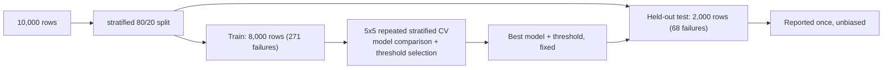
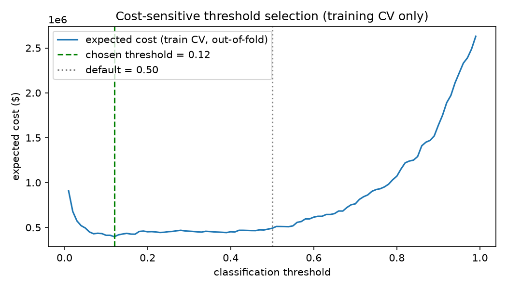
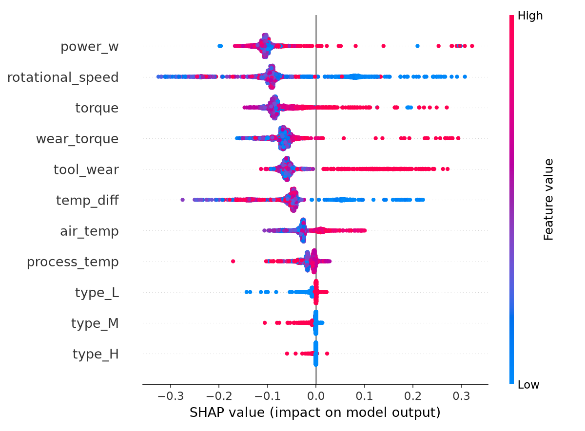

# Predictive Maintenance — Cost-Sensitive Machine Failure Classification

Predicts machine failure on a real industrial predictive-maintenance
benchmark dataset, then answers the question that actually matters
operationally: not "what's the most accurate model?" but "at what
threshold does flagging a machine for inspection actually save money,
given that a missed failure and a false alarm cost very different
amounts?"

**Stack:** Python, pandas, scikit-learn, XGBoost, SHAP, Matplotlib.

## Dataset

[AI4I 2020 Predictive Maintenance Dataset](https://archive.ics.uci.edu/dataset/601/ai4i+2020+predictive+maintenance+dataset)
(Matzka, 2020, UCI Machine Learning Repository). 10,000 records, 5
sensor readings (air/process temperature, rotational speed, torque,
tool wear) per record, a binary machine-failure label, and 5 failure-mode
flags (tool wear, heat dissipation, power, overstrain, random failures).

**Disclosed honestly:** this is a *synthetic* dataset, generated by its
authors to reflect realistic milling-machine behavior and documented
failure mechanisms — not raw sensor logs pulled from a real factory
floor. It's a widely used benchmark for exactly this reason: the failure
mechanisms are known and physically motivated, which makes it possible
to sanity-check whether a model actually learned something real (see
Explainability below) instead of just fitting noise. Results here should
be read as "does this methodology work correctly on a realistic
benchmark," not as claims about any specific real machine.

Failures are rare — 339 of 10,000 rows (3.39%) — which is itself
representative of real maintenance data and shapes every modeling choice
below.

## Feature engineering and leakage

The 5 failure-mode flags (TWF/HDF/PWF/OSF/RNF) are **dropped as
predictors**. `Machine failure` is essentially the union of these flags,
so using them as inputs would mean predicting the label from a
restatement of the label.

Three features are engineered to mirror AI4I 2020's actual published
generative rules, rather than being arbitrary transforms:

| Feature | Formula | Mirrors |
|---|---|---|
| `power_w` | `torque x rotational_speed x 2pi/60` | power failure (electrical power leaves a safe band) |
| `temp_diff` | `process_temp - air_temp` | heat dissipation failure (too little cooling at low speed) |
| `wear_torque` | `tool_wear x torque` | overstrain failure (wear x load exceeds a product-dependent limit) |

This matters later: if the model's top SHAP features line up with these,
it's evidence the model learned the real mechanism, not a shortcut.

## Modeling and split discipline



The held-out test set is touched exactly once, at the end, for both
model evaluation and the cost-sensitive threshold. Everything else —
picking the model, tuning the threshold — happens on the training
portion only, via 5x5 repeated stratified cross-validation.

Metric: **PR-AUC**, not accuracy or ROC-AUC. With a 3.39% positive
class, a model that always predicts "no failure" scores 96.6% accuracy
and tells you nothing; ROC-AUC is optimistic under this much imbalance.
PR-AUC reflects the actual precision/recall trade-off.

| Model | PR-AUC (5x5 CV, train only) |
|---|---|
| Logistic regression | 0.459 ± 0.020 |
| **Random forest** | **0.891 ± 0.012** |
| XGBoost | 0.870 ± 0.014 |

Random forest wins clearly, and the gap over logistic regression is
itself informative: the real failure mechanisms are threshold/product
effects (`wear x torque` exceeding a cutoff, `power_w` leaving a band),
which a linear model structurally can't represent no matter how it's
tuned. Held-out test PR-AUC for the selected model: **0.869** — close to
its CV estimate, so the CV number wasn't a lucky split.

## Cost-sensitive threshold

A missed failure (false negative) means unplanned downtime and possible
secondary damage; a false alarm (false positive) means a technician
checks a healthy machine. Treating those as equally bad — which the
default 0.5 threshold, and even an F1-optimized threshold, both do — is
the wrong question. Costs below are **illustrative business
assumptions**, disclosed as such, not measured data:

- Missed failure: $10,000
- False alarm: $500

The threshold that minimizes expected cost is selected using only
out-of-fold predictions on the training set (5-fold CV) — the held-out
test set is never used to pick it, only to report how the already-fixed
choice performs:

| Threshold | Held-out expected cost |
|---|---|
| 0.50 (default) | $122,000 |
| **0.12 (cost-optimal, chosen on train CV)** | **$106,000** |

**13.1% cost reduction** ($16,000 over 2,000 machines) from moving the
threshold, on data the threshold was never fit to.



## Explainability and sanity check

SHAP on the held-out test set, using the winning random forest:

| Feature | Mean \|SHAP\| |
|---|---|
| power_w | 0.105 |
| rotational_speed | 0.102 |
| torque | 0.077 |
| wear_torque | 0.070 |
| tool_wear | 0.067 |
| temp_diff | 0.063 |
| air_temp | 0.030 |
| process_temp | 0.015 |
| type_L / type_M / type_H | < 0.006 each |

Two of the three engineered mechanism features (`power_w`,
`wear_torque`) land in the top 5, and `temp_diff` is 6th just behind —
the model is leaning on the same physical drivers the dataset was
actually generated from, not on the product-quality dummy variables
(`type_L/M/H`), which barely move the prediction at all. That's the
sanity check this project is designed to allow: a model can hit a high
PR-AUC by fitting noise, and this one didn't.



## Why this matters

A failure classifier that's accurate but scored at the wrong threshold
can still lose money — inspecting too often burns technician time on
healthy machines, inspecting too rarely lets real failures through
uncaught. The model comparison answers "can this be predicted at all,"
but the cost-sensitive threshold is the part that turns a PR-AUC number
into an actual maintenance policy: at what point does a predicted-failure
probability justify pulling a machine in, given what each kind of
mistake actually costs. Getting that threshold from CV on the training
data alone — not from peeking at the test set — is what makes the
reported savings a fair estimate of what would happen on new machines,
not an artifact of tuning against the answer key.

## Limitations

- Synthetic benchmark dataset (see Dataset above) — a real deployment
  would need re-validation on genuine sensor logs.
- The $10,000 / $500 costs are illustrative assumptions for demonstrating
  the methodology, not measured costs from any real facility.
- Single dataset, single train/test split for the final report (mitigated
  by 5x5 repeated CV for model selection, but the held-out number is
  still one split).
- Only 339 positive examples total — even with CV, individual fold
  estimates for the CV standard error are based on a fairly small
  positive-class count.

## How to run

```bash
python -m venv .venv
.venv/Scripts/activate  # or source .venv/bin/activate on Linux/Mac
pip install -r requirements.txt

python src/eda.py
python src/modeling.py
python src/cost_sensitive.py
python src/explainability.py
```

## Files

```
src/
  features.py        # domain-informed feature engineering, leakage-column list
  utils.py            # t-based confidence intervals for CV scores
  eda.py               # class balance, failure-mode breakdown, distributions
  modeling.py         # 80/20 split, 5x5 repeated CV model comparison, held-out eval
  cost_sensitive.py   # cost-optimal threshold selected on train CV only
  explainability.py   # SHAP summary + mechanism-feature sanity check
results/
  figures/            # saved plots
  tables/              # saved CSVs (CV comparison, cost curve, SHAP importances)
  models/              # fitted model + scaler
data/
  ai4i2020.csv        # AI4I 2020 dataset (Matzka, 2020, UCI ML Repository)
```
